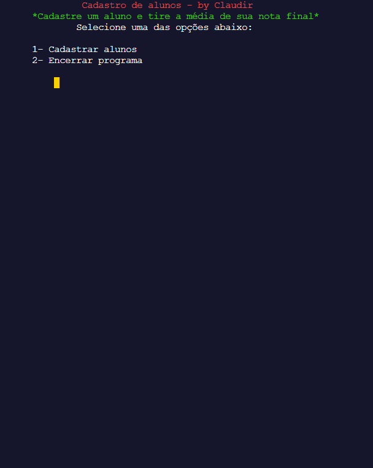

# 📚 Gerenciamento de notas 


> Status: Em desenvolvimento ⚠️
### Execute online: [Executar via website](https://replit.com/@ClaudirSantos/Cadastro-De-Alunos)
<br>

# 📝 Sobre
Este Sistema tem como objetivo auxiliar avaliadores e professores a tirar média da nota de seus alunos de maneira simples e direta. Sistema esse, com uma função de ser um projeto de treino e aplicação de conhecimentos técnicos passados no curso de Python pela instituição Senac SP, no qual eu ainda estou cursando. Conceitos aplcados: Variável acumuladora, lista, verificação de string, loops, funções, while e formatação de strings.
<br>

# 🛠️ Futuras atualizações
+ 1.0 - Mostrar Status de aprovado ou reprovado ✔️
+ 2.0 - Adicionar sistemas novo sistema de notas ❌
+ 3.0 - Registrar mais de um aluno ❌
+ 4.0 - Adicionar interface grática ❌
<br>

# 👨🏾‍💻 Execute na sua máquina

``` bash
# Clone o repositório remoto para sua máquina local: 
git clone https://github.com/TerrorK1ng/Cadastro-De-Alunos.git
```

``` bash
# Em seguida abra a pasta que você clonou do repositório
cd Cadastro-De-Alunos
```

``` bash
# Abra o arquivo <cadastro.py> e execute a partir do comando:
python cadastro.py
```
